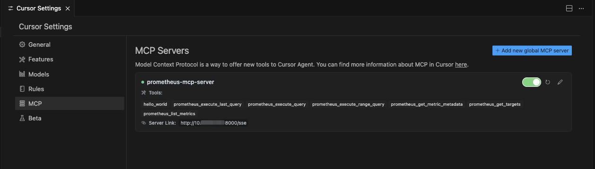

# Prometheus MCP Server
[Model Context Protocol][mcp] 这是一个基于Golang开发的Prometheus-MCP-Server,目前只支持sse运行模式


[mcp]: https://modelcontextprotocol.io

## 功能
- [x] Prometheus MCP Tools
  - [x] 列出可用指标 (prometheus_list_metrics)
  - [x] 发现并探索指标 (prometheus_get_targets)
  - [x] 获取特定指标的元数据 (prometheus_get_metric_metadata)
  - [x] 查看即时查询结果 (prometheus_execute_query)
  - [x] 查看不同步长间隔的范围查询结果 (prometheus_execute_range_query)
  - [x] 查看最近时长查询结果 (prometheus_execute_last_query)
- [x] 支持身份验证
  - [x] 通过环境变量进行基本身份验证
  - [x] 通过环境变量进行 Bearer Token 身份验证
- [x] 支持 Docker 容器化

## 使用方法

1. 确保你的prometheus-mcp-server容器可以与prometheus-server通信.

2. 使用以下命令运行prometheus-mcp-server容器

```bash
# 默认以sse方式运行mcp-server (prometheus无认证)
# 如需stdio模式,请自行将 MCP_SERVER_TRANSPORT=sse 修改为 MCP_SERVER_TRANSPORT=stdio
docker run -d --name prometheus-mcp-server \
  -e PROMETHEUS_URL=http://your-prometheus-server:9090 \
  -e MCP_SERVER_TRANSPORT=sse \
  shaxiaozz/prometheus-mcp-server:latest
```

```bash
# 默认以sse方式运行mcp-server (prometheus basic auth)
# 如需stdio模式,请自行将 MCP_SERVER_TRANSPORT=sse 修改为 MCP_SERVER_TRANSPORT=stdio
docker run -d --name prometheus-mcp-server \
  -e PROMETHEUS_URL=http://your-prometheus-server:9090 \
  -e PROMETHEUS_USERNAME=your_username \
  -e PROMETHEUS_PASSWORD=your_password \
  -e MCP_SERVER_TRANSPORT=sse \
  shaxiaozz/prometheus-mcp-server:latest
```

```bash
# 默认以sse方式运行mcp-server (prometheus token auth)
# 如需stdio模式,请自行将 MCP_SERVER_TRANSPORT=sse 修改为 MCP_SERVER_TRANSPORT=stdio
docker run -d --name prometheus-mcp-server \
  -e PROMETHEUS_URL=http://your-prometheus-server:9090 \
  -e PROMETHEUS_TOKEN=your_token \
  -e MCP_SERVER_TRANSPORT=sse \
  shaxiaozz/prometheus-mcp-server:latest
```

3. 将服务器配置添加到客户端配置文件中。例如，Cursor Desktop:  

url可直接通过命令: ```docker logs prometheus-mcp-server``` 查看
```json
{
  "mcpServers": {
    "prometheus-mcp-server": {
      "url": "http://10.0.0.1:8000/sse"
    }
  }
}
```


## 构建镜像
```bash
git clonse https://github.com/shaxiaozz/prometheus-mcp-server.git && cd prometheus-mcp-server
docker build -t prometheus-mcp-server .
```

## 致谢
- [mark3labs/mcp-go](https://github.com/mark3labs/mcp-go)
- [pab1it0/prometheus-mcp-server](https://github.com/pab1it0/prometheus-mcp-server)

## License
GNU v3.0
